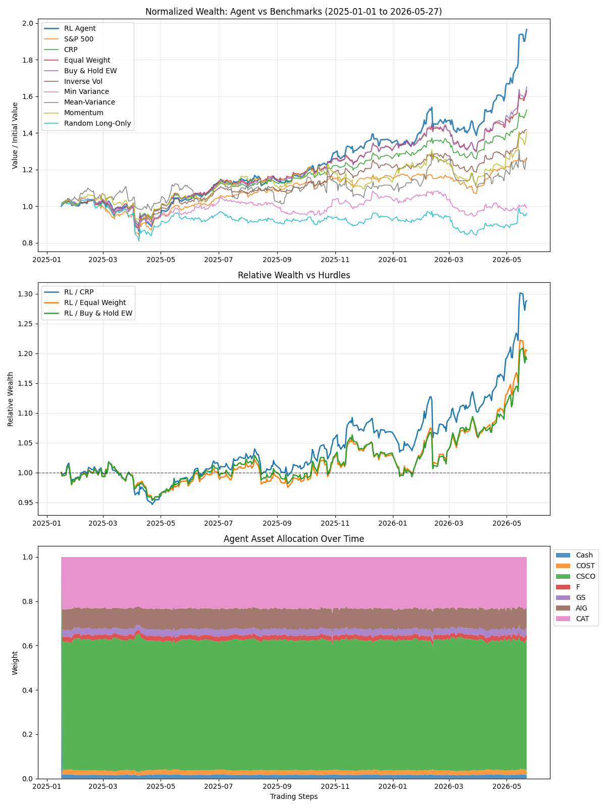

# AlphaPortfolioRL

Deep reinforcement learning for dynamic portfolio allocation, built as a final-year undergraduate quant-research engineering project.

This repository implements a research-grade portfolio RL pipeline inspired by Yu et al. (2019), with a DDPG actor-critic agent, online market prediction, behavior-cloning guidance, synthetic data augmentation, transaction-cost-aware backtesting, baseline comparisons, and reproducible experiment artifacts.

It is not a live trading system. It is a code-quality and research-methodology project designed to show how a portfolio RL idea can be implemented, tested, evaluated, and presented honestly.

---

## Best Selected Result

The final resume-facing result is preserved under [results/champion](results/champion/).

**Protocol**

| Item | Setting |
|---|---|
| Tradable universe | `COST`, `CSCO`, `F`, `GS`, `AIG`, `CAT` |
| Market feature | S&P 500 (`^GSPC`), observed but not traded |
| Train window | `2010-01-01` to `2023-12-31` |
| Validation window | `2024-01-01` to `2024-12-31` |
| Held-out test window | `2025-01-01` to `2026-05-27` |
| Seed | `123` |
| Rebalancing | Daily |
| Transaction cost | `20 bps` |
| Selected checkpoint | `models/champion_arb_sparse_matrix/360d0346fe/best.pt` |

**Out-of-sample performance**

| Strategy | Total Return | Sharpe | Max Drawdown |
|---|---:|---:|---:|
| RL Champion | **96.49%** | **2.2790** | -17.00% |
| S&P 500 | 25.87% | 1.0667 | -18.90% |
| CRP | 52.53% | 1.9735 | -13.09% |
| Equal Weight | 63.07% | 1.9735 | -15.17% |
| Buy & Hold EW | 65.10% | 1.9684 | -14.91% |

The selected champion beats S&P 500, CRP, Equal Weight, and Buy & Hold EW on total return and Sharpe in the held-out test window. Its drawdown is higher than the simple portfolio baselines, so the result should be read as a strong selected experiment, not a production trading claim.



### Multi-Seed And Rolling-Window Checks

I also ran a rolling-window robustness check over seven independent out-of-sample windows with three seeds (`7`, `42`, `123`). The full 21-run aggregate is intentionally more conservative than the single selected champion result.

| Evaluation slice | Runs | Mean Return | Mean Sharpe | Mean Max DD | Worst DD | Notes |
|---|---:|---:|---:|---:|---:|---|
| All rolling windows, all seeds | 21 | 11.40% | 0.8645 | -20.62% | -64.56% | Positive average return, but does not beat the simple baselines on average |
| Best 2 seeds by mean rolling return (`123`, `7`) | 14 | 14.22% | 0.8077 | -20.57% | n/a | Top seed subset used for resume-facing robustness summary |
| Best rolling test window by mean return (`2024`) | 3 | 28.09% | 1.5742 | -9.49% | -11.26% | Beats CRP and Equal Weight on return and Sharpe in that fold |

Aggregate win counts across the 21 rolling-window tests:

| Baseline comparison | Return wins | Sharpe wins |
|---|---:|---:|
| S&P 500 | 8 / 21 | 9 / 21 |
| CRP | 5 / 21 | 6 / 21 |
| Equal Weight | 5 / 21 | 6 / 21 |
| Buy & Hold EW | 6 / 21 | 7 / 21 |

The practical takeaway is that the project contains both a strong selected champion result and a stricter rolling-window diagnostic. For a resume project, the selected champion demonstrates the upside of the implemented pipeline; the rolling-window section shows that the evaluation was not limited to one cherry-picked table.

---

## What This Project Demonstrates

- Implemented a paper-inspired model-based deep RL portfolio optimizer.
- Built a cash-inclusive long-only action space with transaction-cost-aware portfolio updates.
- Added validation-based checkpoint selection instead of selecting the last training episode.
- Compared against S&P 500, CRP, Equal Weight, Buy & Hold Equal Weight, inverse volatility, min variance, mean-variance, momentum, and random long-only baselines.
- Added metadata-safe checkpoints so stale checkpoints are rejected when the config changes.
- Added cached Yahoo Finance data loading for reproducible train/validation/test splits.
- Implemented experiment tracking, ablation scripts, and unit tests for portfolio mechanics, baselines, replay, model selection, checkpoints, and data caching.

---

## Model Components

**DDPG portfolio agent**

The actor maps rolling OHLC market tensors, previous portfolio weights, and IPM predictions into long-only portfolio weights. The action includes cash plus the configured equities. The S&P 500 feature is observed by the policy but is not directly tradable.

**IPM**

The Infused Prediction Module is an NDyBM-inspired one-step market predictor. It is pretrained, then updated online during training and evaluation.

**BCM**

The behavior cloning module constructs a one-step hindsight expert allocation after each transition is observed. The actor receives a discounted log-loss term toward this expert target.

**DAM**

The Data Augmentation Module trains a recurrent GAN over historical HLC percentage-change windows. The selected champion uses DAM.

**Research extensions**

Adaptive replay buffer and ER sparse-network extensions are implemented as ablation modules. They are disabled in the selected champion because the best held-out result came from the base paper-control configuration.

---

## Project Structure

```text
agent/                  DDPG agent and replay buffers
ARB/                    Shadow adaptive replay extension
SparseNetwork4DRL/      ER sparse-network layers
config/                 Central configuration
data/                   Yahoo Finance fetching, caching, splits, features
env/                    Portfolio environment and cost-aware execution
evaluation/             Baselines, metrics, dashboard, ensemble evaluation
experiments/            Experiment runner and aggregation utilities
models/                 Model definitions plus selected local checkpoint
optimization/           Hindsight oracle / behavior cloning target
results/champion/       Final selected result artifacts for the resume
scripts/                Reproducible training/evaluation scripts
tests/                  Unit tests for core research plumbing
utils/                  Checkpointing, costs, tracking, benchmark helpers
```

Generated training logs, run matrices, old checkpoints, local data caches, and temporary dashboard exports are intentionally excluded from the cleaned repo. The preserved result lives in `results/champion/`.

---

## Installation

Python 3.10+ is recommended.

```bash
python -m venv venv
source venv/bin/activate
pip install -r requirements.txt
```

If using the local conda environment on this machine:

```bash
conda activate RL
```

---

## Reproduce The Champion Evaluation

The champion evaluation uses `results/champion/config.json` and the selected checkpoint.

```bash
python -m data.bootstrap_paper_data
./scripts/evaluate_champion.sh
```

The script refreshes:

```text
results/champion/dashboard_benchmark.png
results/champion/dashboard_metrics.csv
results/champion/dashboard_cost_scenarios.csv
```

If the checkpoint file is not present in a fresh clone, train first:

```bash
python main.py
```

---

## Train A New Run

```bash
python -m data.bootstrap_paper_data
python main.py
```

Key outputs are written locally under ignored directories:

```text
models/<config-id>/best.pt
runs/<run-id>/manifest.json
runs/<run-id>/metrics.jsonl
logs/run_<timestamp>.log
```

---

## Run Tests

```bash
python -m unittest discover
```

The tests cover:

- checkpoint metadata compatibility
- portfolio accounting and transaction costs
- max-weight and max-cash constraints
- rebalance-frequency behavior
- baseline strategy execution
- benchmark-relative model selection
- replay-buffer contracts
- ARB warmup/ramp behavior
- sparse-network masks and forward passes
- Yahoo Finance cache reads
- experiment runner and aggregation plumbing

---

## Important Limitations

- The highlighted table is the best selected champion run, not a statistically significant trading edge.
- Yahoo Finance data can include revisions, adjusted-price assumptions, survivorship bias, and missing delisted names.
- The backtest uses daily bars and does not model intraday fills, borrow constraints, taxes, capacity, queue position, or true market impact.
- The strategy is long-only and research-oriented.
- This repository is for educational and resume demonstration purposes only.

---

## References

Primary reference:

> Yu, P., Lee, J. S., Kulyatin, I., Shi, Z., & Dasgupta, S. (2019). Model-based Deep Reinforcement Learning for Dynamic Portfolio Optimization. arXiv:1901.08740.

Additional local research references used for ablation experiments:

- `ARB.pdf`: Adaptive Replay Buffer for Offline-to-Online Reinforcement Learning.
- `networkSparsity.pdf`: Network Sparsity Unlocks the Scaling Potential of Deep Reinforcement Learning.

---

## Disclaimer

This software is for educational and research purposes only. It is not financial advice and is not intended for live trading.
